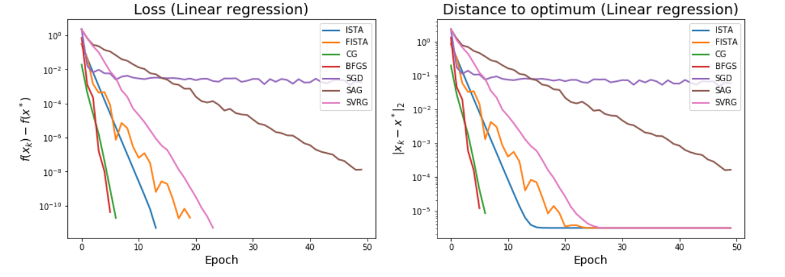
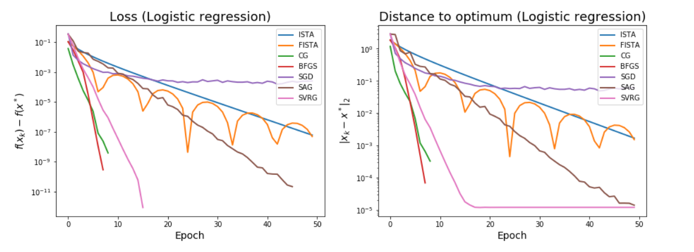

# Optimization
This is the optimization course (lectures, labs, project) of the M2 Data Science.

**Lecturers** : Alexandre Gramfort and &amp; Robert Gower. 

This course is a review of gradient-based algorithms to solve empirical risk minimization problems both from a theorical (convergence proof and speed) and practical approach (implementation in python). In addition, it covers also the proximal approach, and deals with regularization.

**Outline** :

1. **First order algorithms**

Study & implementation of ISTA and FISTA algotithms.

2. **Coordinate descent**

A method that minimizes along coordinate directions to find the minimum of a function, making the convergence faster.

3. **Conjugate gradient descent**

Iterative method to solve linear problems with positive definite matrices.

4. **Quasi-Newton methods**

These methods leverage the Taylor expansion around the optimal to approach the hessian for approaching Newton Method (which does not scale, as such)

5. **Stochastic Gradient Descent**

The famous deep learning method that instead of calculating the gradient over the whole dataset, computes it on a mini batch. This gradient estimate has no bias but has high variance. 

6. **SGD with variance reduction**

Some extensions of gradient descent to reduce variance. Algorithms SAG, SAGA, SVRG.

# Labs

The labs study empirically the optimization concepts seen in class. We test the models on toy datasets generated for the least-squares and the logistic cases.

The methods we tested are:

- gradient descent (GD)
- accelerated gradient descent (AGD)
- L-BFGS
- conjugate gradient (CG)
- Stochastic algorithms
- stochastic gradient descent (SGD)
- stochastic averaged gradient (SAG)
- stochastic variance reduced gradient (SVRG)

We obtain the faster results with BFGS and CG. Even ISTA and FISTA perform well. This problem is obviously well conditionned. Globally, the stochastic algorithms are less efficient. SGD starts fast, but it quickly reaches the area of the equilibrium and it stagnates around it (it may be due to a too large variance).

In the logistic case, SVRG performs better than ISTA and FISTA. We can clearly observe the non monotically decrease of FISTA. In this case, the stochastic algorithm narrow the gap with the deterministic ones.

### Conclusion

With a low correlation between the features, the deterministic solvers are more efficient, especially BFGS. However, The stochastic solvers outperforms the latters when the features are highly correlated. The impact of regularization on the algorithms' performances is less obvious. Globally, excepted SVRG, the stochastic solutions are slower and less efficient when the conditionning is great.

# Project : Optimization strategies for anomaly detection with One class Support Vector Machines (OCSVM)

## Objectives
- Derive the dual for the one-class SVM model,

- implement a one-class SVM using a blackbox convex toolbox (cvxopt in Python),

- implement your own solvers with: Proximal gradient, Coordinate Descent, Quasi-Newton,

- present a clear benchmark of the different strategies on small and medium scale datasets.

## Author
Benoît-Marie ROBAGLIA (benoit-marie.robaglia@polytechnique.edu)

